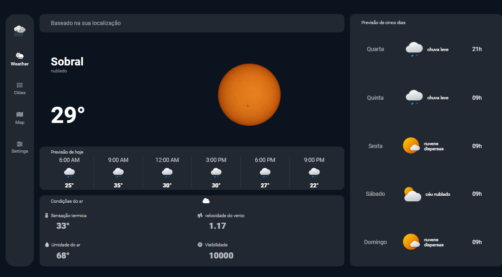
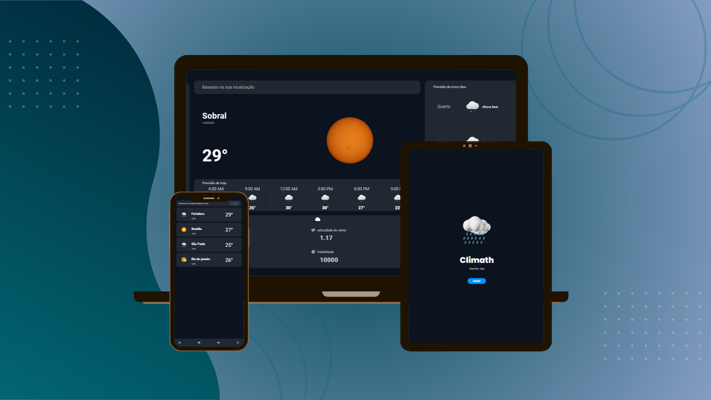
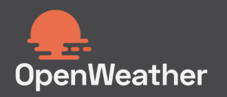
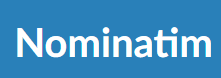

The main goal of the project is to improve my JavaScript skills. For this project, I use two tools: Nominatim, a search tool for city names based on the user's latitude and longitude, and OpenWeatherMap, a platform that provides real-time weather information and forecasts for more than 200,000 cities worldwide. The application provides the following information:
<ul> 
<li>‣ Weather forecast based on the user's city</li>
<li>‣ Thermal sensation.</li>
<li>‣ Air humidity</li>
<li>‣ Wind speed</li>
<li>‣ Visibility</li>
<li>‣ Meteorological forecast for the next five days.</li>
<li>‣ Search for the current temperature of any city.</li>
</ul>
The application is still under development, and I will soon add a weather map of selected cities and an illustrative settings panel.

 

  

 Tools used:

 

 

